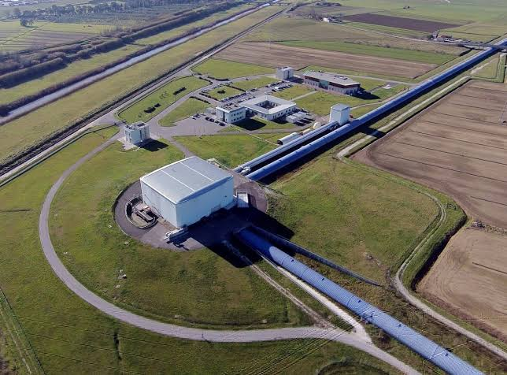
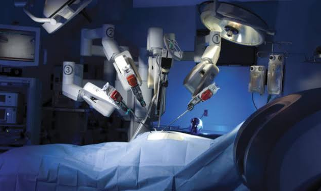
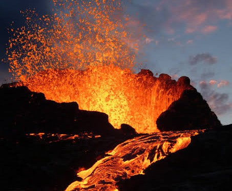

# Guia de Estudo - Detecção de anomalias em séries temporais para descoberta de fraudes financeiras

## Séries Temporais

### Introdução
#### Séries Temporais estão em todos os lugares

|                Produção de energia                 |            Astrofísica             |            Medicina             |         Vulcanologia          |
| :------------------------------------------------: | :--------------------------------: | :-----------------------------: | :---------------------------: |
|  |  |  |  |

## Detecção de anomalias

## Modelos não supervisionados

## Redução de dimensionalidade